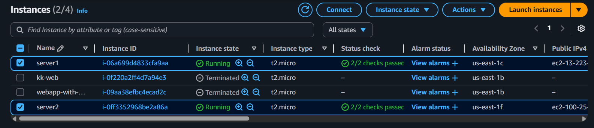
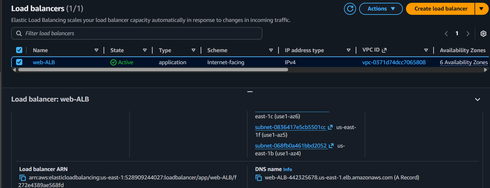
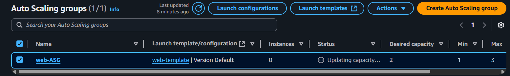

# AWS-elb-asg-project
AWS Simple Project  — EC2 Auto Scaling with Elastic Load Balancer

This project demonstrates deploying a web application on AWS using:
- **EC2 Launch Template**
- **Auto Scaling Group**
- **Elastic Load Balancer (ALB)**

## 📸 Screenshots

### 1. EC2 Instances

### 2. Load Balancer

### 3. Auto Scaling Group

### 4. Web Page Output

✅ **Key AWS Services Used**
- Amazon EC2  
- Elastic Load Balancer (ALB)  
- Auto Scaling Group   

📅 **Completed by:** Krithik  

